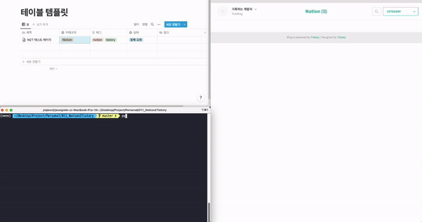
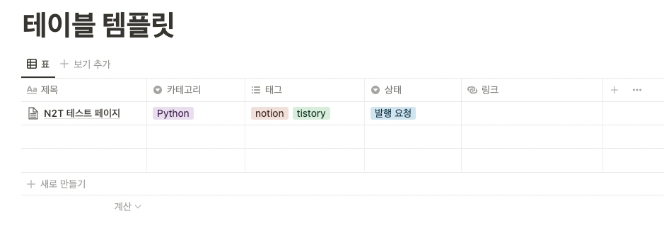
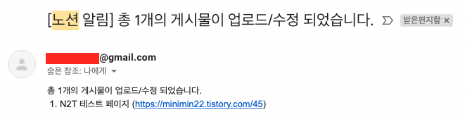

# 기능

아래와 같은 노션 테이블 페이지에서 상태 컬럼을 발행 요청/수정 요청으로 두면 해당 내용이 자동으로 티스토리 블로그로 업로드 해줍니다.



# 준비사항

- Python 등 개발관련 기초 지식
- 크롬 부라우저 (selenium 사용)
- 카카오와 연동된 티스토리 계정
- 티스토리 Open API 에서 본인의 블로그 등록
    - App ID, Secret Key 발급
- (선택) 앱 비밀번호가 생성된 Gmail 계정 (포스팅 알림용)

# 사용방법

## 노션 테이블 템플릿 만들기

- 아래와 같이 표형식 table을 만들고 테이블 컬럼을 아래와 같이 만들어줍니다.
- 아래 링크를 클릭해서 템플릿을 복제해서 사용하셔도 됩니다.
     - [템플릿 링크](https://wistful-trick-85a.notion.site/08e08d36ac3544a7ab21f141232b311b?v=92376629a4d74c358d47228fbd9edcce)

| 컬럼명 | 속성 | 설명                                                            |
|-----| --- |---------------------------------------------------------------|
| 제목  | 제목 | 업로드할 게시물의 제목                                                  |
| 카테고리 | 선택 | 게시물의 카테고리                                                     |
| 태그  | 다중 선택 | 게시물의 태그들                                                      |
| 상태  | 선택 | 발행 요청,수정 요청으로 되어있을 때 게시물을 업로드 함 <br> 업로드 완료 이후에는 발행 완료로 값이 바뀜 |
| 링크  | URL | 발행 완료 후 업로드된 url 링크가 자동 입력됨                                   |



## 코드 clone하기

- 로컬 PC의 원하는 디렉토리로 가서 코드를 clone 합니다.

```bash
git clone https://github.com/jmjeon94/N2T.git
```

### 패키지 설치하기

- 아래 명령어로 코드 실행에 필요한 패키지를 설치해줍니다.

```bash
pip3 install -r requirements.txt
```

## 설정 파일 입력하기

config.py 파일을 열고 각 항목에 본인에 맞게 값을 입력해줍니다.  
아래 설정 파일에 적는 항목은 티스토리 업로드 권한 획득(token 발급) 외에 전혀 사용하지 않습니다.

### Tistory 설정

- TISTORY의 ID, PW는 카카오로 연동된 계정으로 카카오 계정과 비밀번호를 적어야 합니다.
- BLOG_NAME: 본인의 블로그 이름 xxx.tistory.com 에서 xxx를 입력 합니다.
- SECRET KEY, CLIENT ID, REDIRECT_URI: [Open API 등록](https://www.tistory.com/guide/api/manage/register) 시 발급받은 값을 입력합니다.
    - [Open API 등록 방법](https://minimin2.tistory.com/82)

### Notion 설정

- TOKEN_V2: [여기](https://minimin2.tistory.com/99#05cfe4a1-87e1-4edf-a903-66f3e7cdcac1) 를 확인해서 본인의 token_v2값을 입력합니다.
- TABLE_PAGE_URL: 자동으로 업로드할 notion page의 url을 입력합니다.
- DOWNLOAD_DIR: notion page를 html 파일로 임시 다운로드 할 경로입니다.
- CODE_BLOCK_THEME: 코드블럭을 사용하시는 분에 한해서 테마를 지정합니다. 테마 목록은 [여기](https://highlightjs.org/static/demo/) 에서 확인할 수 있습니다. (default: atom-one-dark)

### MAIL 설정 (선택)

- mail은 선택 사항으로 게시물 발행시 메일로 알림을 보내줍니다. 사용하지 않을 시 빈칸으로 두시면 됩니다.
- Gmail만 가능하며 ID에는 gmail 계정을 입력합니다.
- KEY값에는 gmail 계정의 앱 비밀번호를 입력해줍니다.
    - [gmail 계정 KEY값(앱 비밀번호) 가져오는 법](https://minimin2.tistory.com/44)

```python
# config 파일 예시
cfg = dotdict(
    TISTORY=dotdict(
        ID='kakao email' # 전화번호가 아닌 이메일 주소를 사용해야 합니다.
        PW='kakao password',
        BLOG_NAME='blog_name',
        SECRET_KEY='xxx',
        CLIENT_ID='xxx',
        REDIRECT_URI='https://blog_name.tistory.com',
    ),
    NOTION=dotdict(
        TOKEN_V2='xxx',
        TABLE_PAGE_URL='https://www.notion.so/xxx',
        DOWNLOAD_DIR='~/.n2t',
        CODE_BLOCK_THEME='atom-one-dark',

        COLUMN=dotdict(
            TITLE='제목',
            CATEGORY='카테고리',
            TAG='태그',
            STATUS='상태',
            URL='링크'
        ),

        POST=dotdict(
            UPLOAD_VALUE='발행 요청',
            MODIFY_VALUE='수정 요청',
            COMPLETE_VALUE='발행 완료',
        ),
    ),
    MAIL=dotdict(
        ID='',
        KEY='',
    )
)
```

## 업로드하기

- 터미널에서 아래 명령어로 main.py 파일을 실행해 줍니다.

```python
python3 main.py
```

만약 Gmail 설정값을 입력해줬다면 아래처럼 업로드 알람 메일이 옵니다.

